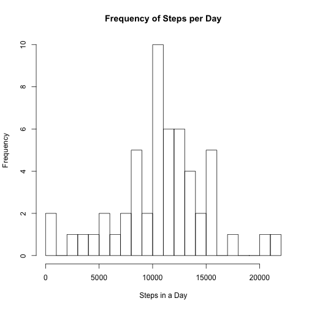
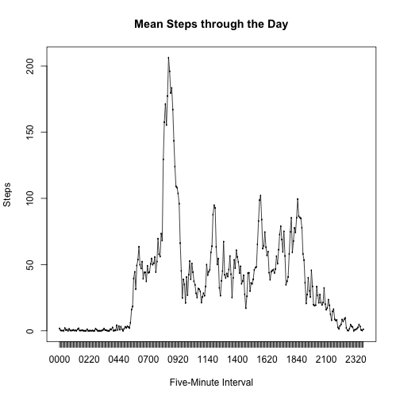
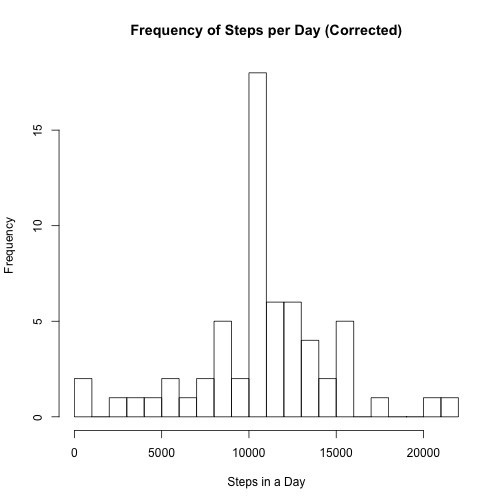
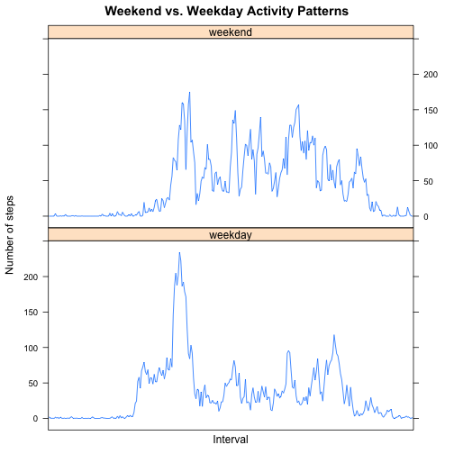

## Load and analyze activity data, per assignment.

Setup:

- Load required libraries
- Set echo = TRUE (per assignment)
- Disable warnings (because they're annoying -- mostly time zone for POSIXlt)


```r
library(knitr)
library(lattice)

opts_chunk$set(echo = TRUE, warning = FALSE)
```

## Loading and preprocessing the data
Read data from activity.csv into **steps**, extracting from ZIP file if necessary:


```r
files <- list.files()
if (! ("activity.csv" %in% files)) {
    unzip("activity.zip")
}

steps <- read.csv("activity.csv", as.is = TRUE)
steps$interval <- as.factor(sprintf("%04d", steps$interval))
```

We also cast the interval as a factor that looks like "nnnn".

## What is mean total number of steps taken per day?

Aggregate the steps by day:


```r
steps_by_day <- aggregate(x = steps[c("steps")],
                          FUN = "sum",
                          by = list(Group.date=steps$date))
```

Histogram of same:


```r
hist(steps_by_day$steps,
     breaks = 20,
     main = "Frequency of Steps per Day",
     xlab = "Steps in a Day")
```

 

Calculate mean and median steps per day:


```r
mean_steps   <- mean(steps_by_day$steps, na.rm=TRUE)
median_steps <- median(steps_by_day$steps, na.rm=TRUE)
```

The mean number of steps per day is 10766.2, and the median is 10765.

## What is the average daily activity pattern?

Break down steps by interval and plot:


```r
steps_by_interval <- aggregate(steps ~ interval,
                               steps,
                               function(x) mean(x, na.rm = TRUE))

plot(steps_by_interval$interval,
     steps_by_interval$steps,
     type = "l",
     main = "Mean Steps through the Day",
     xlab = "Five-Minute Interval",
     ylab = "Steps")

# Lines don't seem to come out, so add this as backup.
lines(steps_by_interval$interval,
      steps_by_interval$steps)
```

 

Find the interval with the maximum number of steps:


```r
max_steps <- max(steps_by_interval$steps)

max_interval <- steps_by_interval$interval[
    which.max(steps_by_interval$steps == max_steps)]
```

The interval with the highest mean number of steps, 206.2,
begins at 0835.


## Imputing missing values

Count missing values:


```r
missing_value_count = sum(is.na(steps$steps))
```

There are 2304 missing values in the original data set.

Fill in missing values with mean values for the five-minute interval:


```r
corrected <- steps # New data set

# Fill in missing values in new data set, using mean values from each interval
for (i in 1:length(corrected$steps)) {
    if (is.na(corrected[i, "steps"])) {
        # For missing values, look up previously-calculated mean value
        # for corresponding interval.
        interval <- corrected[i, "interval"]
        interval_index <- which(steps_by_interval$interval == interval)
        fillin <- steps_by_interval[interval_index, "steps"]
        corrected[i, "steps"] <- fillin
    }
}
```

Calculate statistics on, and plot histogram of, "corrected" data set:


```r
corrected_steps_by_day <- aggregate(x = corrected[c("steps")],
                                    FUN = "sum",
                                    by = list(Group.date = corrected$date))

hist(corrected_steps_by_day$steps,
     breaks = 20,
     main = "Frequency of Steps per Day (Corrected)",
     xlab = "Steps in a Day")
```

 

```r
# Calculate corrected mean and median.
corrected_mean_steps   <- mean(corrected_steps_by_day$steps, na.rm=TRUE)
corrected_median_steps <- median(corrected_steps_by_day$steps, na.rm=TRUE)

# Calculate percent change in corrected values from original values, for display.
mean_change_pct   <- (corrected_mean_steps / mean_steps - 1) * 100
median_change_pct <- (corrected_median_steps / median_steps - 1) * 100
```

The "corrected" mean number of steps is 10766.2,
a 0.000% change from 10766.2.

The "corrected" median number of steps is 10766.2,
a 0.011% change from 10765.0.

## Are there differences in activity patterns between weekdays and weekends?

Add weekday/weekend indicator to data set:


```r
# If day starts with "S", it's a weekend; otherwise a weekday.
steps$day_type <- factor(
    ifelse(
        grepl("^S", weekdays(as.POSIXlt(steps$date, "%Y-%m-%d"))),
        "weekend",
        "weekday"))

steps_by_interval_and_day_type <- aggregate(steps ~ interval + day_type,
                                            steps,
                                            function(x) mean(x, na.rm = TRUE))
```

Plot data by weekend/weekday:


```r
xyplot(steps ~ interval | day_type,
       data = steps_by_interval_and_day_type,
       layout = c(1, 2),
       panel = function(x, y, ...) {
           panel.lines(x, y, ...)
       },
       main = "Weekend vs. Weekday Activity Patterns",
       xlab = "Interval",
       ylab = "Number of steps",
       scales = list(x = list(draw = FALSE),
                     y = list()))
```

 
